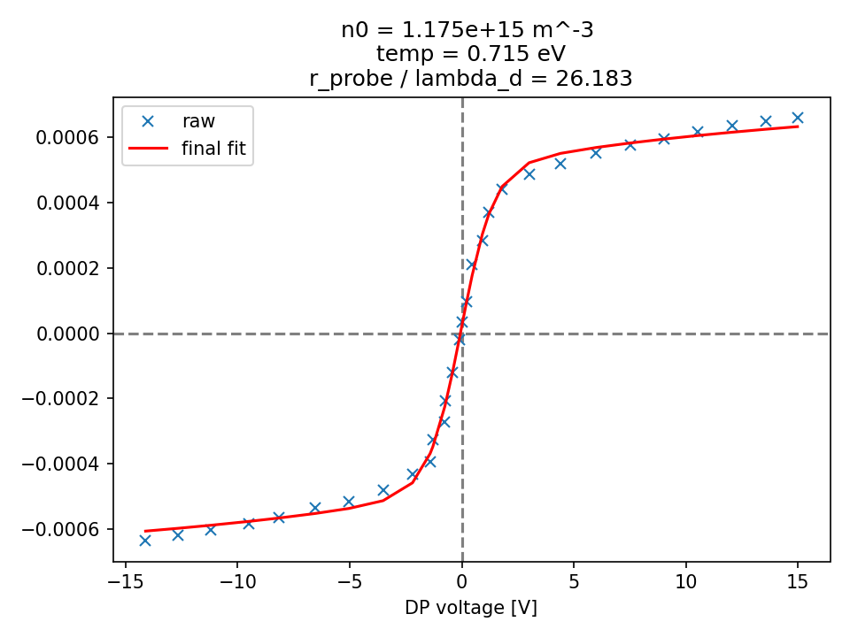
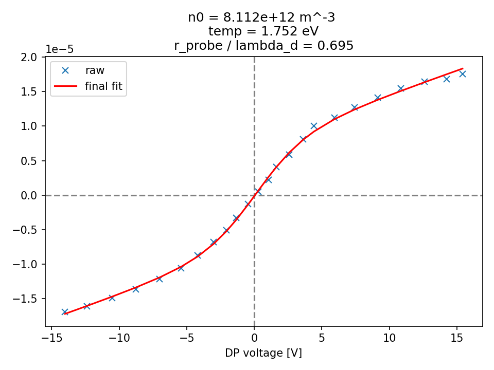

# double_langmuir_probe_analysis
This is a (mostly faithful) reproduction of the double Langmuir probe analysis as described by Beal and Brown.  

# Known differences between my implementation and the analysis in the papers.
- I allow for an optional voltage and current offset during the fit.  
- I use scipy's curve_fit() function to perform my fitting

# Examples
I've included two plots that contain raw data similar to the two datasets in Beal's paper.  I've overlayed fits on both.

# References
This code is primarily based on:
- Brian Beal's "Improved analysis techniques for cylindrical and spherical double probes". 
	 - https://aip.scitation.org/doi/10.1063/1.4739221
- Daniel Brown's "Experimental Assessment of Double Langmuir Probe Analysis Techniques in a Hall Thruster Plume".  
	 - https://doi.org/10.2514/6.2012-3869

# Notes
- There is a discrepancy (possibly typos?) in the probe geometries between the two papers referenced above.  Specifically, I think the `radius' and `diameter' may have been accidentally swapped. 

# Disclaimer
I make no gaurantee as to the accuracy of this code although I will push any corrections that I discover.  If anyone else notices any issues, please let me know.  
